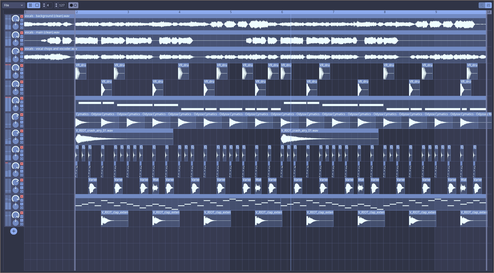

<div align="center">

# Generic DAW

[](https://github.com/iced-rs/iced)
[](https://github.com/generic-daw/generic-daw/blob/master/LICENSE)
[](https://github.com/generic-daw/generic-daw/actions/workflows/rust.yml)
[](https://deps.rs/repo/github/generic-daw/generic-daw)

An early-in-development, open source, cross-platform digital audio workstation (DAW) built in Rust.
</div>



## Installation & Getting Started

### Requirements

- Rust & Cargo: this project is developed using the latest stable [Rust toolchain](https://rustup.rs/)
- on Linux you'll also need to install the alsa development headers:
  - Debian: `sudo apt install libasound2-dev`
  - Fedora: `sudo dnf install alsa-lib-devel`
  - Arch: `sudo pacman -S alsa-lib`

### Build from Source

```bash
git clone https://github.com/generic-daw/generic-daw.git
cd generic-daw
curl https://unpkg.com/lucide-static@latest/font/Lucide.ttf -Lo Lucide.ttf
cargo build --release
```

## Roadmap

See the current development status and future plans in the dedicated [GitHub project](https://github.com/orgs/generic-daw/projects/1).

## License

Generic DAW is licensed under the [GPLv3 License](https://www.gnu.org/licenses/gpl-3.0).
By contributing to Generic DAW, you agree that your contributions will be licensed under the GPLv3 as well.
