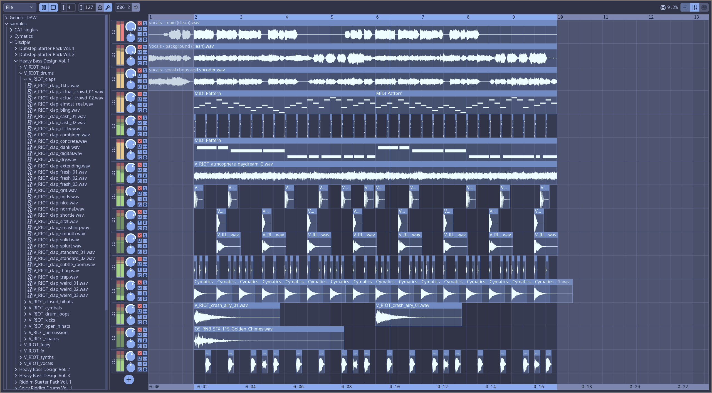

<div align="center">

# Generic DAW

[](https://github.com/iced-rs/iced)
[](https://github.com/generic-daw/generic-daw/blob/master/LICENSE)
[](https://github.com/generic-daw/generic-daw/actions/workflows/rust.yml)
[](https://deps.rs/repo/github/generic-daw/generic-daw)

An early-in-development, open source, cross-platform digital audio workstation (DAW) built in Rust.
</div>



## Running

### Download

Binaries are built for x64 Windows and Linux, as well as ARM MacOS. If you're signed in to GitHub, they are downloadable from the [automated builds](https://github.com/generic-daw/generic-daw/actions/workflows/rust.yml?query=branch:main) page. Alternatively, if you're not signed in to GitHub, they are downloadable from [here](https://nightly.link/generic-daw/generic-daw/workflows/rust/main).

### Build from Source

#### 1. Requirements

- Rust & Cargo: Generic DAW is developed using the latest stable [Rust toolchain](https://rustup.rs)
- on Linux you'll also need to install the ALSA and PipeWire development headers:
  - Debian: `sudo apt install libasound2-dev libpipewire-0.3-dev`
  - Fedora: `sudo dnf install alsa-lib-devel pipewire-devel`
  - Arch: `sudo pacman -S alsa-lib libpipewire`

#### 2. Compiling

Run the following shell commands to clone the source code and compile a release build:

```
git clone https://github.com/generic-daw/generic-daw.git
cd generic-daw
curl https://unpkg.com/lucide-static@latest/font/Lucide.ttf -Lo Lucide.ttf
cargo build --release
```

The binary will then be located at `./target/release/generic_daw`.

## Roadmap

See the current development status and future plans in the dedicated [GitHub project](https://github.com/orgs/generic-daw/projects/1).

## Contributing

Contributions are welcome both on [GitHub](https://github.com/generic-daw/generic-daw) and [Codeberg](https://codeberg.org/generic-daw/generic-daw). If you'd like to work on a larger feature or bugfix, coordinating your work with what I'm currently doing is generally a good idea, to ensure conflicts stay at a minimum. If that's the case, feel free to get in touch via a [GitHub discussion](https://github.com/generic-daw/generic-daw/discussions) or on Discord.

This project adheres to the [Rust Audio AI policy](https://rust.audio/community/ai).

## License

Generic DAW is licensed under the [GPLv3 License](https://www.gnu.org/licenses/gpl-3.0).
By contributing to Generic DAW, you agree that your contributions will be licensed under the GPLv3 as well.
